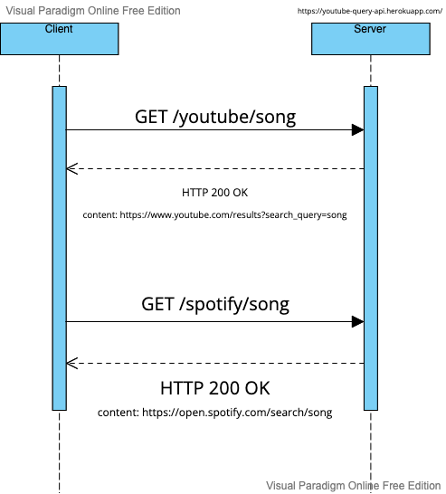

# Youtube/Spotify Query API

This project is a REST API designed to translate text into Youtube or Spotify search URLs. 

*e.g. 'Michael Jackson' -> 'https://www.youtube.com/results?search_query=michael+jackson'*

This API was made with Flask and hosted using Heroku.


## Requesting Data

The API can be called at https://youtube-query-api.herokuapp.com/{service}/{text}. 

The user can communciate the choice between a Youtube or Spotify 
URL and the text to be translated as path parameters. An example call is https://youtube-query-api.herokuapp.com/spotify/adele.

Utilizing a module to handle GET requests makes the process simple as the caller does not need to worry about URL encoding. Here is an example with the 
Python requests module:

```python
import requests

text = 'hotline bling'
response1 = requests.get('https://youtube-query-api.herokuapp.com/youtube/'+ text)
response2 = requests.get('https://youtube-query-api.herokuapp.com/spotify/'+ text)
```

## Receiving Data

After confirming an OK status code, the URL can be found in the message body of the response. 


```python 
print(response1.text) # https://www.youtube.com/results?search_query=hotline+bling
print(response2.text) # https://open.spotify.com/search/hotline%20bling
```

## UML



## Run locally

To run this program on your local machine, do the following:

1. Clone repo, then cd into directory
2. Create virtual environment

    ```console
    python -m venv venv
    ```
3. Activate virtual environment
    ```console
    . venv/bin/activate
    ```
4. Install required packages
    ```console
    pip install -r requirements.txt
    ```
5. Run app
    ```console
    export FLASK_APP=main.py
    flask run
    ```